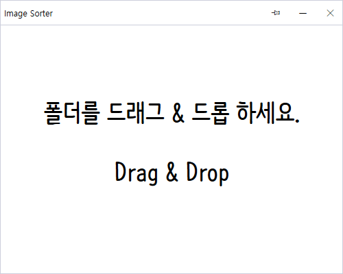

# Image Sorter

```
* 이미지 파일을 지정된 규칙대로 정렬해주는 윈도우 프로그램
```

# 프로젝트

## 개발 목적
```
* 윈도우에서 파일을 이름에 맞춰 정렬을 하면 9, 10, 11 순서대로 정렬을 못하고
* 10, 1, 2, 3 처럼 정렬되는 버그가 있어서 개발했다.
```

## 프로그램



```
* 폴더를 드래그 드롭으로 추가하면 자동으로 정렬해준다.
```

## 정렬 규칙

```
* 자리수가 늘어날때마다 알파벳이 바뀌는 형식
* A1 ~ A9
* B10 ~ B99
* C100 ~ C999
* D1000 ~ D9999
...
```

## 변경사항

```
* 2022.06.21
* .NET 3.1 -> .NET6
* Windows 11 에서 동작 확인
```

## 라이센스

##### GNU General Public License v3.0

##### Copyright 2020-2022 chm209 all right reserved
